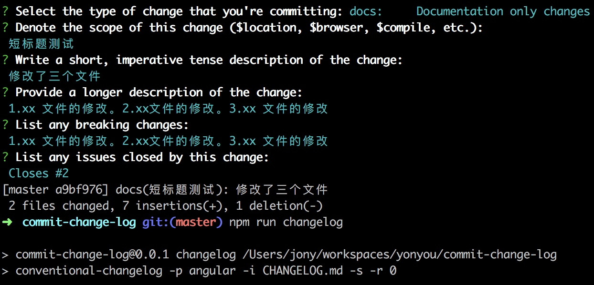
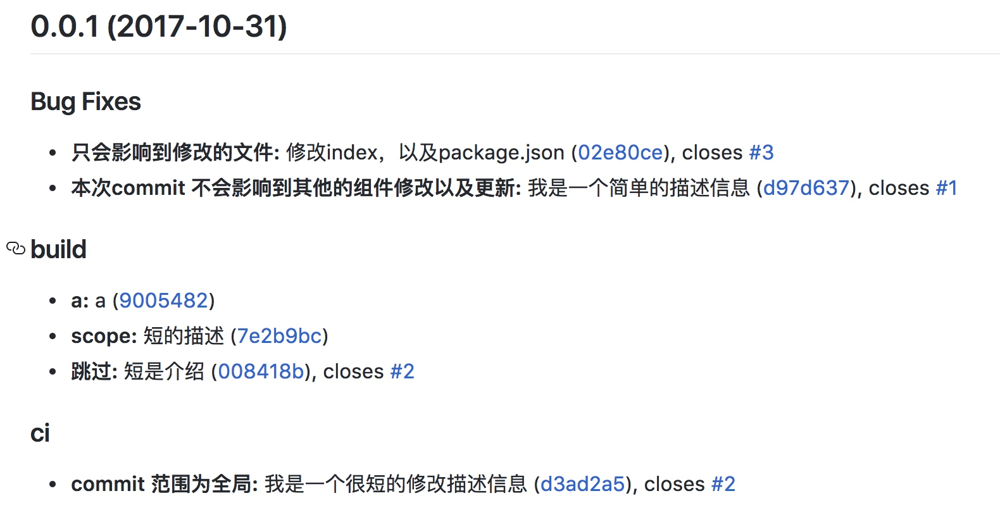

# bee-tools集成changelog使用方式

## 1、安装Commitizen

> Commitizen是一个格式化commit message的工具。

    npm install -g commitizen
    

## 2、初始化配置
    
    在项目中执行  
    
    bee-tools run changelogInit

## 3、带log的提交

完成上面2步骤后，如果想生成带log的提交，执行
    
    git cz
    ....(参考git cz命令截图)。
    
## 4、发布上线
    
    执行 bee-tools run pub

1. 如果修改一次性把bug修复完毕，且提交不用执行第3步骤,在执行pub是可以设置log。
2. 如果分批提交，且修改同一个bug，生成多条log记录。需要在每次提交时执行git cz，最后一次次可以直接执行。

        执行 bee-tools run pub
     
        提示： do you wang run changelog ?(y/n)
         直接回车即可。

如果确定修改完毕，执行发布命令，在发布命令中，会让你输入是否是否再次生成log 的提交。(可选)

## 3、git cz 命令截图

## 4、效果截图

## 注解

用来标识 commit 的类型，总共有以下 11 个标识：

	feat: 添加了一个新功能
	fix: 修复了一个 bug
	docs: 文档发生修改
	style: 不影响代码运行的更改（空格，格式，缺少分号等）
	refactor: 重构代码且不引进新的功能或修复 bug
	perf: 代码优化
	test: 添加或修改测试用例
	build: 构建工具或外部依赖的更改（npm，webpack，gulp等）
	ci: 更改项目级的配置文件或脚本
	chore: 除上述之外的修改
	revert: 撤销改动先前的提交

