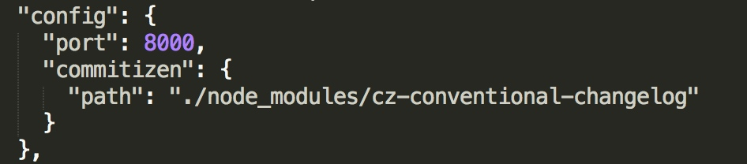
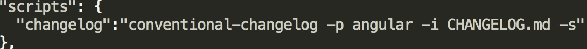

# changelog使用方式

## 1、Commitizen

> Commitizen是一个格式化commit message的工具。

    npm install -g commitizen
    
    commitizen init cz-conventional-changelog --save --save-exact

>此操作会修改package.json文件。
>

git cz替换git commit命令

## 2、conventional-changelog-cli
>就是生成 Change log 的工具。

    npm install -g conventional-changelog-cli
    cd my-project
    conventional-changelog -p angular -i CHANGELOG.md -s
    
>现在是配置在package.json中   

## 3、命令截图

## 4、效果截图

## 注解
### 1.commit message 格式

commit message 主要包括三个部分：Header、Body、Footer。

除 Header 外，Body、Footer均为非必填项。

### 2.Header

Header 要求单行，其中包括 <type>、<scope>、<subject>三个部分。

### 3.type

用来标识 commit 的类型，总共有以下 11 个标识：

	feat: 添加了一个新功能
	fix: 修复了一个 bug
	docs: 文档发生修改
	style: 不影响代码运行的更改（空格，格式，缺少分号等）
	refactor: 重构代码且不引进新的功能或修复 bug
	perf: 代码优化
	test: 添加或修改测试用例
	build: 构建工具或外部依赖的更改（npm，webpack，gulp等）
	ci: 更改项目级的配置文件或脚本
	chore: 除上述之外的修改
	revert: 撤销改动先前的提交

### 4.scope

用来标识改动所影响的范围，视项目而定。

### 5.subject

改动的简短描述，不超过 50 字符长度。

### 6.Body

本次 commit 的详细描述。

### 7.Footer

主要用于两种情况：

1. 重大的不兼容改动: 用于给出改动说明及解决方案。
2. 关联 issues: 用于关闭相应 issues。

> 特别注意：使用 revert 标识撤销 commit 时，subject 应为所撤销的 commit 的 message， Body 应包含 所撤销的 commit 的 hash。
格式如下：

